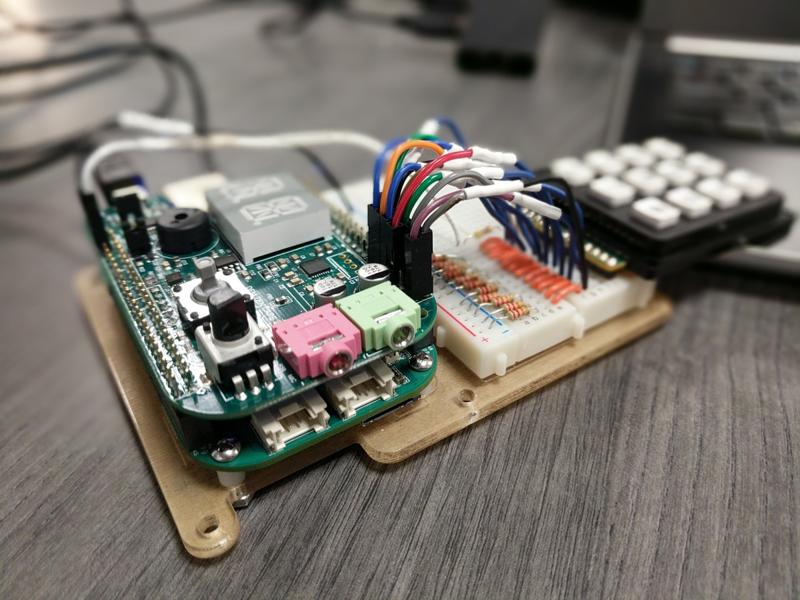
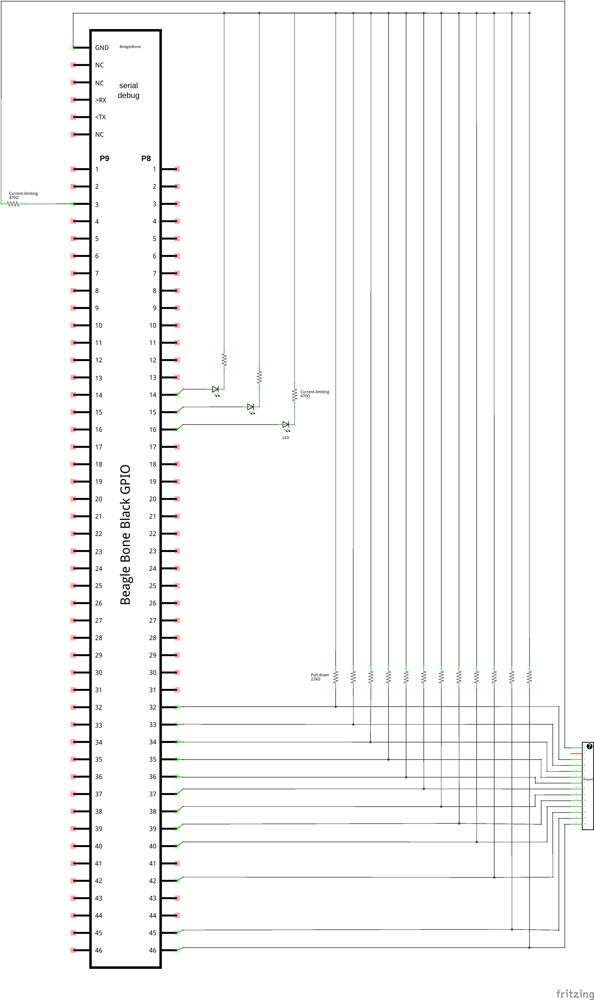

# CMPT 433 Project: Tin Can Telephones

BeagleBone and ZenCape program which connects two devices over remote communication through VoIP (Voice over Internet Protocol). This is a project for _CMPT 433: Embedded Systems_ at Simon Fraser University in Fall 2019.



## README Notes

Commands starting with `$` are meant to be run on the host.  
Commands starting with `#` are meant to be run on the target.

## Detailed Overview

This project uses [PortAudio](http://www.portaudio.com/) for recording sound and [Advanced Linux Sound Architecture (ALSA)](https://alsa-project.org/) for playing and managing sound through a wired USB headset.

The volume is controlled by turning the potentiometer on the ZenCape.

**Hardware components:**
  * Beaglebone Green
  * ZenCape
  * Wired USB headset
  * [12-digit keypad](https://www.rpelectronics.com/12key-12-key-keypad-common-ground.html)
  * Potentiometer

**Creators:** Rulai Hu, Bryce Haley, Paymon Jalali, Jeffrey Leung

## Setup

### Beaglebone

Connect your BeagleBone to the host computer.

Create the directory `~/cmpt433/public/myApps/` on the host computer:
```shell
$ mkdir -p ~/cmpt433/public/myApps/
```

Mount a remote Network File Server (NFS) from the BeagleBone to the directory above.

### Networking

For your BeagleBone to communicate with other BeagleBones over ethernet, the IP address of `eth0` must be set.

This can be done with

```
# sudo ip ad add 10.0.0.0/24 dev eth0
```
Replacing `10.0.0.0` with the IP address you want to be identified as.

However, this IP address will not persist once the board is rebooted. To have a persistent IP do the following:

* Add the following lines to the end of `/etc/network/interfaces` on the BeagleBone (replacing `10.0.0.0` with the IP address yu want to be identified as):
```shell
auto eth0
iface eth0 inet static
  address 10.0.0.0
  netmask 255.255.255.0
  broadcast 0.0.0.0 
```
* Either reboot the board, or restart your networking service with:
```shell
# sudo /etc/init.d/networking restart
```
* Now, the IP address should persist through reboots
### The Program

Clone the GitHub repository:
```shell
$ git clone csil-git1.cs.surrey.sfu.ca/hurulaih/cmpt433-project.git
```

Enter the repository directory:
```shell
$ cd cmpt433-project/
```

Build the executable and send it to the BeagleBone through the NFS:
```shell
$ make
```

Connect to the BeagleBone and run the executable:
```
# ./tincanphone
```

## Schematic

A Fritzing schematic is provided in the directory `schematic/`.



To edit the Fritzing file, download [Fritzing](https://fritzing.org/download/).

Open Fritzing, select **File**, and choose **Open**. Select the library `schematic/AdaFruit.fzbz` to load the BeagleBone part.

Select **File** and choose **Open** to load the schematic.

## Installing PortAudio on the BBG

### Prerequisites
* ALSA must be installed and configured on the target.
* The target must have internet access enabled

SSH or screen into the target machine.

Install library `libasound2-dev`:
```shell
# apt-get install libasound2-dev
```

Overwrite the ALSA config with the one provided in our repository (but not before making a copy first):
```shell
# cp /usr/share/alsa/alsa.conf /usr/share/alsa/alsa.conf.before-tincantelephones
# cp alsa.conf /usr/share/alsa/alsa.conf
```

Download, make and configure PortAudio **on the target**:
```shell
# cd /mnt/remote/
# wget http://portaudio.com/archives/pa_stable_v190600_20161030.tgz
# tar xvzf pa_stable_v190600_20161030.tgz
# ./configure && make
```

**Important**: Ensure that PortAudio is correctly configured by checking the configuration summary. You should see something like this:

```
Configuration summary:

  Target ...................... armv7l-unknown-linux-gnueabihf
  C++ bindings ................ no
  Debug output ................ no

  ALSA ........................ yes
  ASIHPI ...................... no

  OSS ......................... yes
  JACK ........................ no
```

It is vital that ALSA is **yes**. Otherwise, `libasound2-dev` has not been correctly installed on the target.

### Troubleshooting

Are you experiencing:

* Segfaults, or "unable to open stream" errors?
  * Make sure the correct device index is being targeted. For the audio jacks, it's **0**. For USB headphones, it's **1**.
  * `make device_info` and then run the `device_info` program on the target. If you don't see a list of devices (more than zero) then ALSA isn't set up correctly.

* A whole bunch of runtime errors such as `ALSA lib pcm.c:2495:(snd_pcm_open_noupdate) Unknown PCM surround71`?
  * Make sure the default `alsa.conf` is overwritten with the one provided and the errors will go away.

## Volume Mixer Service

The volume mixer is a standalone application that controls the volume of the PCM channel of the board with the potentiometer on the Zen Cape, and displays the current volume of the board on the 14-seg display.

 This section will walk through the steps to get the volume mixer running on the Beaglebone, but please note that the following assumptions are made: NFS drive has been configured to map to `~/cmpt433/myApps` on the host, and the audio cape and i2c pins have been properly configured.

The volume mixer application code can be found in its own directory within the project repository. Enter the project directory, and compile it:

```shell
$ cd cmpt-433-project/volume_mixer
$ make
```

After compiling the application, the make command will copy it to the target via the NFS folder along with the `volume_mixer.service` file.

Now, we can configure the application on the target. First, connect to the target via ssh or screen, and mount the NFS drive then do the following (all commands must be run with `sudo`):

```
# mkdir /opt/10-VolumeMixer/
# cp /mnt/remote/myApps/volume_mixer /opt/10-VolumeMixer/
# cp volume_mixer.service /lib/systemd/system/
# systemctl enable volume_mixer.service
# systemctl start volume_mixer.service
```

The Volume Mixer has now been enabled via systemd, and will start on boot.

### Note: By default, the volume mixer attaches itself to control the audio output from the zen cape.
To make it work for another device do the following:

* Open the file `src/volume_mixer.c`within the `volume_mixer` directory
* Find the line `const char *selem_name = "PCM";` and change `PCM`to the name of your device (found with `alsamixer`)
* Build and deploy with instructions above


## System Overview

See a map of the system here:

