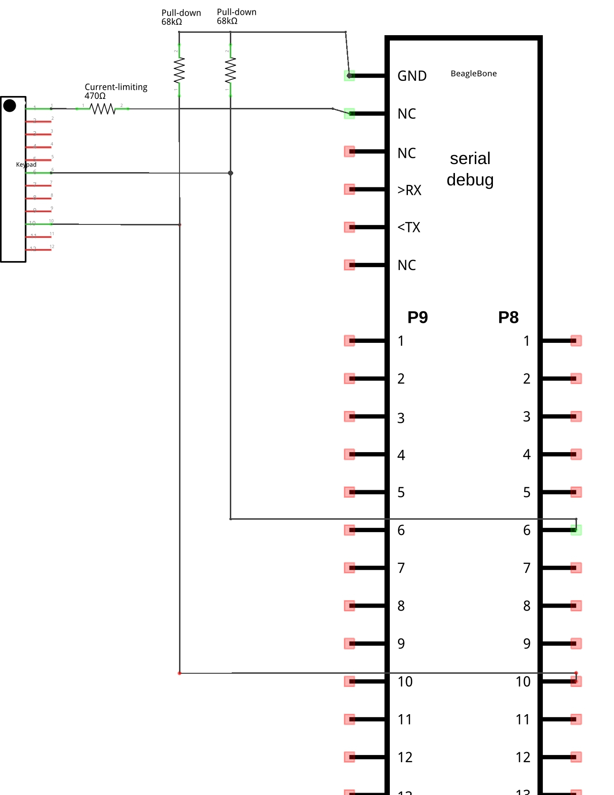

# CMPT 433 Project: Tin Can Telephones

BeagleBone program which connects two devices over remote communication through VoIP (Voice over Internet Protocol).

## Setup

### Beaglebone

Connect your BeagleBone to the host computer.

Create the directory `~/cmpt433/public/myApps/` on the host computer:
```shell
mkdir -p ~/cmpt433/public/myApps/
```

Mount a remote Network File Server (NFS) from the BeagleBone to the directory above.

### The Program

Clone the GitHub repository:
```shell
git clone csil-git1.cs.surrey.sfu.ca/hurulaih/cmpt433-project.git
```

Enter the repository directory:
```shell
cd cmpt433-project/
```

Build the executable and send it to the BeagleBone through the NFS:
```shell
make
```

SSH into the BeagleBone and run the executable:
```shell
./tincanphone
```

## Schematic

A Fritzing schematic is provided in the directory `schematic/`.



To edit the Fritzing file, download [Fritzing](https://fritzing.org/download/).

Open Fritzing, select **File**, and choose **Open**. Select the library `schematic/AdaFruit.fzbz` to load the BeagleBone part.

Select **File** and choose **Open** to load the schematic.

## Installing PortAudio on the BBG

This section is a work in progress.

### Prerequisites
* ALSA must be installed and configured on the target.
  * Then overwrite the ALSA config with the one provided in our repo: `cp alsa.conf /usr/share/alsa/alsa.conf`
* The target must have internet access enabled.

If you haven't installed libasound2-dev on the target:
* `apt-get install libasound2-dev`

Download, make and configure PortAudio **on the target**:
* `cd /mnt/remote/`
* `wget http://portaudio.com/archives/pa_stable_v190600_20161030.tgz`
* `tar xvzf pa_stable_v190600_20161030.tgz`
* `./configure && make`

**Important**. Ensure that PortAudio is correctly configured by checking the configuration summary. You should see something like this:

```
Configuration summary:

  Target ...................... armv7l-unknown-linux-gnueabihf
  C++ bindings ................ no
  Debug output ................ no

  ALSA ........................ yes
  ASIHPI ...................... no

  OSS ......................... yes
  JACK ........................ no
```

The important part is that ALSA is **yes**. Otherwise, libasound2-dev has not been correctly installed on the target.

### Troubleshooting

* Segfaults, or unable to open stream errors
  * Make sure the correct device index is being targeted. For the audio jacks, it's **0**. For USB headphones, it's **1**.
  * `make device_info` and then run the `device_info` program on the target. If you don't see a list of devices (more than zero) then ALSA isn't set up correctly.
* Getting a whole bunch of runtime errors such as `ALSA lib pcm.c:2495:(snd_pcm_open_noupdate) Unknown PCM surround71`.
  * Make sure the default alsa.conf is overwritten with the one provided and the errors will go away.
